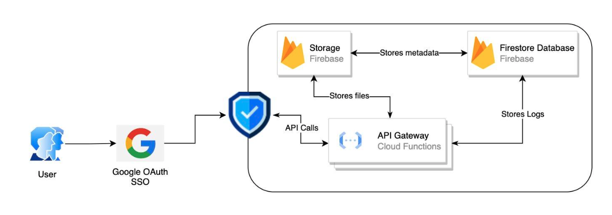
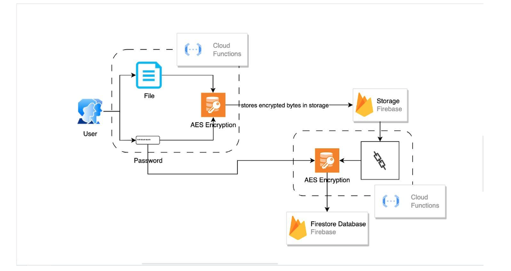
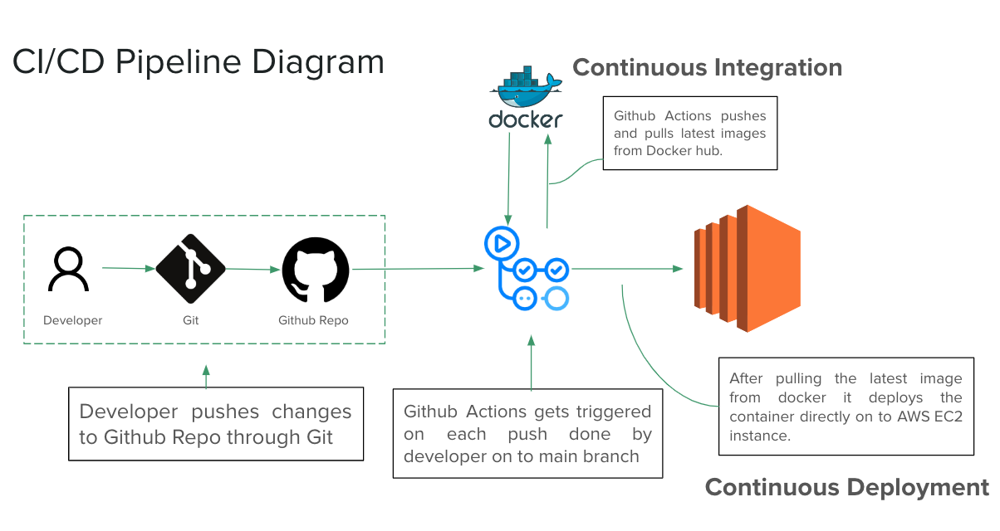

## Guardian - CMPE 272 Final Project

Web Link: https://guardian.asish.site/

Demo Link: https://www.youtube.com/watch?v=nEFG9Q4FkPg

## Team Members
- Dheeraj Nandigama -    dheeraj.nandigama@sjsu.edu
- Anandu Sreekumar   -  anandu.sreekumar@sjsu.edu
- Asish Raju Vachavaya  - asishraju.vachavaya@sjsu.edu  
- Jeswanth Vadlamudi - jeswanth.vadlamudi@sjsu.edu

## About
Guardian provides a safe online space where businesses can exchange trade secrets and private information with other businesses or within their own firm. 
The platform provides an easy-to-use, secure hub for enterprises to exchange personal files. Robust encryption and fine-grained access controls protect confidential data from prying eyes.

## Features

- Secure login with SSO and MFA
- Cross organization data sharing with encryption at every step
- User based restricted access
- End to end encryption of every single data
- Self hosted option
- Action tracking on the platform for auditing and compliance reasons
- Encrypted backups and export options
- Set auto expiry to share permissions along with files/folders/passwords
- External share blocking

## Technologies Used

**Frontend**: Nextjs

**Backend**: NodeJS, Firebase

**Encryption** Handling: NodeJS

**Database**: Firestore

**Infrastructure**: Amazon Web Services

**Authentication**: Google SSO

**CI/CD**: Docker  & GitHub

## Architecture

## Encryption & Decryption Flow

## CI/CD Pipeline

